# Abstract

In dit onderzoek is gekeken naar de relatie tussen slaapkwaliteit, hartslag en dagelijkse gewoonten bij drie proefpersonen over een periode van vier weken. Met behulp van een Fitbit-smartwatch zijn onder andere hartslag, slaapgegevens en stappen per dag gemeten. Daarnaast vulden de proefpersonen elke ochtend een korte vragenlijst in over hun gedrag, zoals bewegen, eten en schermgebruik.
Het doel van dit onderzoek was om te bepalen of een lagere hartslag samenhangt met betere slaapkwaliteit. Hierbij is vooral gekeken naar de gemiddelde hartslag tijdens de slaap als maat voor slaapkwaliteit, omdat de Fitbit-slaapscore minder betrouwbaar leek door onaccurate meting van slaapduur en de invloed hiervan op de slaapscore.
Uit de resultaten blijkt dat de gemiddelde rusthartslag en het aantal stappen per dag op groepsniveau significant samenhangen met de gemiddelde hartslag tijdens slaap. Personen met een hogere gemiddelde rusthartslag of minder stappen hebben gemiddeld ook een hogere hartslag tijdens de slaap. Wanneer er echter wordt gecorrigeerd voor verschillen tussen personen, verdwijnen deze verbanden, wat laat zien dat individuele verschillen groot zijn en een belangrijke rol spelen.
Daarnaast blijkt dat de Fitbit-slaapscore geen betrouwbare maat is voor slaapkwaliteit in deze dataset, maar wel sterk samenhangt met de hoeveelheid REM-slaap. Andere factoren zoals calorieën, stress en timing van eten laten geen duidelijke significante verbanden zien.
Door het kleine aantal proefpersonen en meetdagen zijn de resultaten verkennend. Vervolgonderzoek met meer deelnemers en meer metingen per persoon is nodig om sterkere conclusies te kunnen trekken.

# Introductie

Slaap is een van de belangrijkste processen voor het herstel van het lichaam en de hersenen. Tijdens de slaap vertraagt de hartslag, wat vaak een teken is dat het lichaam goed tot rust komt. Een lagere hartslag tijdens de slaap wordt daarom vaak gezien als een teken van goede slaapkwaliteit (Cleveland Clinic, 2024).
Uit onderzoek blijkt dat verschillende factoren invloed hebben op de hartslag. Zo spelen stress, lichamelijke beweging en dagelijkse gewoonten een grote rol bij hoe hoog of laag de hartslag is, zowel overdag als tijdens de slaap (Valentini & Parati, 2009). Wanneer het lichaam voldoende kan herstellen, daalt de hartslag en komt het lichaam in een diepere rusttoestand.
In dit onderzoek wordt gekeken of een betere slaapkwaliteit samenhangt met een lagere gemiddelde hartslag, zowel overdag als tijdens de slaap. Drie proefpersonen meten gedurende vier weken hun hartslag met behulp van een Fitbit-smartwatch. Deze smartwatch houdt continu de hartslag bij en verzamelt ook gegevens over de slaap.
Naast de hartslagmetingen vullen de proefpersonen elke dag een korte vragenlijst in. Hierin noteren zij factoren die mogelijk invloed hebben op hun slaap en hartslag, zoals lichamelijke beweging, alcoholgebruik, laat eten en schermgebruik vlak voor het slapengaan. Het gebruik van een telefoon voor het slapen kan de slaap verstoren en zorgen voor een minder diepe slaap, wat invloed kan hebben op de hartslag (Cleveland Clinic, 2022).
De verwachting is dat proefpersonen met een lagere gemiddelde rusthartslag beter slapen. Ook wordt verwacht dat voldoende beweging overdag en het beperken van storende gewoonten, zoals veel schermgebruik voor het slapen, bijdragen aan een lagere hartslag en een betere slaapkwaliteit.
Dit onderzoek is belangrijk omdat het laat zien hoe dagelijkse gewoonten invloed hebben op slaap en hartslag. Door deze verbanden beter te begrijpen, kunnen mensen bewuster keuzes maken die zorgen voor betere rust en herstel.

---

# Materiaal en methode

### Hypothese

In dit onderzoek kijken we naar de relatie tussen gemiddelde rusthartslag en gemiddelde hartslag tijdens de slaap.

H0 (nulhypothese): Er is geen verband tussen de gemiddelde rusthartslag en de gemiddelde hartslag tijdens de slaap.
H1 (alternatieve hypothese): Er is wel een verband tussen de gemiddelde rusthartslag en de gemiddelde hartslag tijdens de slaap. Een hogere gemiddelde rusthartslag gaat samen met een hogere gemiddelde hartslag tijdens de slaap.
---

### De proefpersonen (Deelnemers)
* Er doen precies **3 vaste personen** mee aan dit onderzoek.
* Iedereen doet **4 weken (28 dagen)** lang elke dag mee.
* De gegevens van deze 3 personen worden veilig en anoniem bewaard.

---

### Wat hebben we nodig?
* **Fitbit Versa 4**: Een slim horloge dat de hartslag, stappen en slaap meet.
* **Google Forms**: Een online vragenlijst die de proefpersonen invullen.
* **Excel**: Een computerprogramma om aan het einde alle cijfers in te verzamelen.
* **Python**: Een computerprogramma om de data te verwerken en samen te voegen.
* **RStudio**: Een computerprogramma om de samengevoegde data te analyseren en grafieken te maken.

---

#### Wat moeten de proefpersonen doen?

#### Het horloge dragen
* Draag het horloge om de pols waar je **niet** mee schrijft.
* Zorg dat het horloge niet te los zit, zodat de sensor aan de achterkant je hartslag goed kan meten.
* Houd het horloge **altijd om**, ook in bed. Je mag het alleen afdoen om te douchen of om op te laden.

#### Elke ochtend invullen
* **Heel belangrijk**: Vul de online vragenlijst (Google Forms) **elke ochtend binnen 15 minuten na het opstaan** in. Als je langer wacht, vergeet je hoe laat je gisteravond precies hebt gegeten of op je telefoon hebt gekeken.

---

### De Google Forms (De vragen en keuzes)

De online vragenlijst heeft precies deze vragen en keuzes:

#### Tijd en Datum
1. **Wat is de huidige datum?**
   * *Antwoord*: Klik de dag van vandaag aan (dag/maand/jaar).
2. **Hoe laat ben je gaan slapen?**
   * *Antwoord*: Vul de tijd in (bijvoorbeeld 23:15).
3. **Hoe laat ben je opgestaan?**
   * *Antwoord*: Vul de tijd in (bijvoorbeeld 07:30).

#### Sporten, schermen en eten
4. **Heb je een fysieke activiteit gedaan?**
   * *Kies één antwoord*:
     * nee
     * ja, lichte inspanning (korte wandeling, kort stuk gefietst, etc.)
     * ja, gemiddelde inspanning (krachttraining, lange wandeling, etc.)
     * ja, zware inspanning (hardlopen, racefietsen, mountainbiken, etc.)
5. **Hoe laat heb je voor het laatst op je telefoon gezeten?**
   * *Antwoord*: Vul de tijd in. *(Let op: dit telt ook voor de TV of laptop!)*
6. **Wanneer heb je voor het laatst gegeten?**
   * *Antwoord*: Vul de tijd in van je laatste hap eten.

#### Soort eten en je naam
7. **Wat was het?**
   * *Kies één antwoord*:
     * Snack
     * Maaltijd - mager
     * Maaltijd - vol vet
8. **Naam**
   * *Antwoord*: Typ hier je eigen naam.

---

### Wat doen we aan het einde met de cijfers?

Als de 4 weken voorbij zijn, gaan we alle verzamelde gegevens samenvoegen en bestuderen
Ook maken we de namen anoniem door ze te vervangen door "Persoon 1", "Persoon 2" en "Persoon 3".:

#### Data downloaden via Fitbit Takeout
Aan het einde van de 4 weken loggen we in op de Google/Fitbit-account van de 3 proefpersonen. We gebruiken **Fitbit Takeout** om alle gedetailleerde gegevens (zoals de exacte hartslag per minuut en de slaapfases) als computerbestanden te downloaden. Ook downloaden we alle antwoorden uit de Google Forms.

#### Data samenvoegen met Python
De gegevens van de Fitbit en de Google Forms worden in Python samengevoegd tot één groot bestand. In dit bestand staan alle metingen per dag, zoals de gemiddelde hartslag tijdens slaap, het aantal stappen, de tijd van het laatste eten, etc.

#### Analyseren met R-code
We laden de bestanden van de Google Forms en de Fitbit Takeout samen in **RStudio**. Met behulp van **R-code** gaan we berekeningen maken en controleren we de volgende dingen:
* Slaap je korter of onrustiger als je vlak voor het slapengaan nog op een scherm hebt gekeken?
* Slaat je hart 's nachts sneller of onrustiger na een maaltijd met vol vet vergeleken met een magere maaltijd?


# Resultaten en discussie


### Toelichting op de grafieken en berekeningen

In onze analyse zijn lineaire regressiemodellen gebruikt om te kijken hoe slaap, hartslag en leefstijl samenhangen.

Deze keuze is gemaakt omdat de meeste variabelen continu zijn, zoals slaapduur, hartslag, REM-slaap, stappen en calorieën;
De grafieken van de resultaten van de drie proefpersonen laten we gecombineerd zien, zodat ze makkelijk te vergelijken zijn.

We hebben de slaapscore en de gemiddelde hartslag tijdens slaap als indicatoren voor slaapkwaliteit gebruikt.
Echter, de slaapscore bleek sterk afhankelijk van de slaapduur, en deze werd niet altijd accuraat gemeten door de Fitbit. Daarom hebben we besloten om de gemiddelde hartslag tijdens slaap als een betrouwbaardere maat voor slaapkwaliteit te gebruiken, omdat deze minder beïnvloed wordt door de onnauwkeurigheid van de slaapduurmetingen.
Daarom focussen wij ons op de gemiddelde hartslag tijdens de slaap als een maat voor slaapkwaliteit. Een lagere gemiddelde hartslag tijdens de slaap duidt op een betere slaapkwaliteit, omdat het aangeeft dat het lichaam goed tot rust komt en herstelt (Cleveland Clinic, 2024).

Verder is er een meervoudige regressie-analyse uitgevoerd om te onderzoeken welke factoren samenhangen met de gemiddelde hartslag tijdens de slaap.
In deze analyse zijn alle gemeten variabelen meegenomen: slaapduur, REM-slaap, diepe slaap, stappen, stressmanagementscore, calorieverbranding en tijd tussen telefoongebruik en slapen. 
Ook is er een model gemaakt waarin rekening wordt gehouden met verschillen tussen personen.

De R^2-waarden van de regressies laten zien hoeveel van de variatie in gemiddelde hartslag tijdens slaap verklaard wordt door deze factoren.
De p-waarden geven aan of deze verbanden statistisch significant zijn, wat betekent dat ze waarschijnlijk niet door toeval ontstaan zijn.

### Meervoudige Regressie Gemiddelde Hartslag Slaap vs. Factoren
```{r echo=FALSE, out.width="80%"}
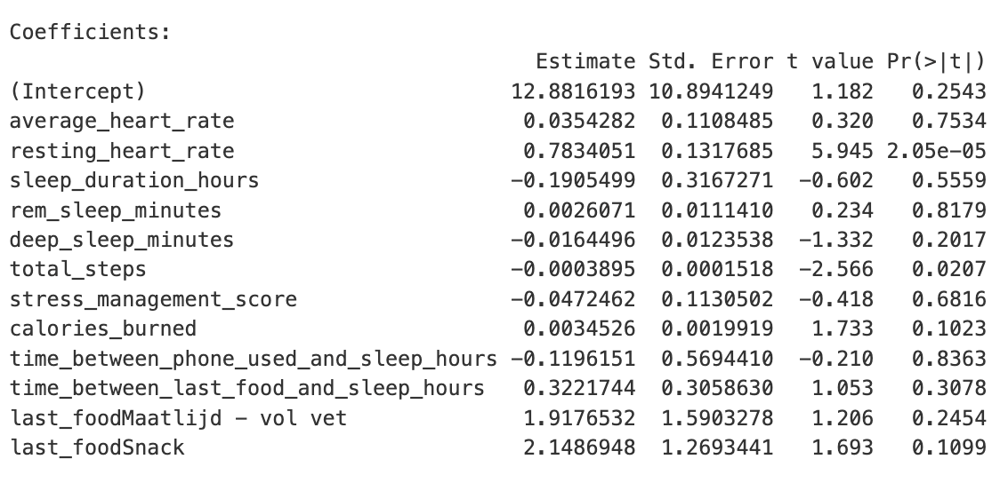

```

In dit model is de gemiddelde rusthartslag statistisch significant geassocieerd met de gemiddelde hartslag tijdens slaap (p = 0.000029). Dit betekent dat gemiddelde rusthartslag in deze dataset een duidelijke voorspeller is van de gemiddelde hartslag tijdens slaap.

Daarnaast is ook het verband tusssen laatste eten als snack en de gemiddelde hartslag tijdens slaap  (p = 0.035) en de dagelijkse stappen (p = 0.02) significant. Deze waarden zijn wel een stuk hoger dan de andere p-waarde, dus minder betrouwbaar.
De overige variabelen in dit model hebben p-waarden > 0.05 en zijn in deze steekproef niet statistisch significant.

Verder is hier de adjusted R^2 0.82, wat betekent dat ongeveer 82% van de variatie in gemiddelde hartslag tijdens slaap verklaard wordt door dit model. Dat is een vrij hoog percentage, wat aangeeft dat deze variabelen samen een sterk verband hebben met de slaaphartslag in deze dataset.
Als de adjusted R^2 = 0.82 dan is r = 0.91.


### Power berekening
```{r echo=FALSE, out.width="40%"}
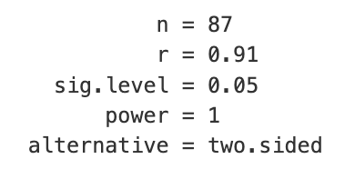
```

Als we naar de power-berekening kijken zien we dat de power 1 is bij een r van 0.91, Wat betekent dat de kans bijna 100% is dat we een bestaand effect ook als statistisch significant detecteren.

De significante uitkomst voor de gemiddelde rusthartslag ondersteunt het idee dat nachten met een hogere gemiddelde rusthartslag vaak samengaan met een hogere gemiddelde slaaphartslag.
Voor de meeste andere voorspellers blijft het bewijs beperkt, waarschijnlijk door een combinatie van een kleine steekproef, natuurlijke variatie tussen nachten en personen, en overlap tussen de verschillende voorspellers.
Dat een snack als laatste maaltijd geassocieerd is met een lagere gemiddelde slaaphartslag kan wijzen op een mogelijk gunstig effect van een lichte maaltijd, maar de betrouwbaarheid hiervan is beperkt en vraagt om verder onderzoek.
Daarnaast lijkt het erop dat personen met een lagere gemiddelde rusthartslag ook een lagere gemiddelde hartslag tijdens slaap hebben.
Daarom is de persoon als factor toegevoegd aan het model, zodat er rekening wordt gehouden met verschillen tussen personen.

### Meervoudige Regressie Gemiddelde Hartslag Slaap vs. Factoren (met persoon als factor)

persoon als factor toevoegen zodat het model rekening houdt met verschillen tussen personen:
```{r echo=FALSE, out.width="80%"}
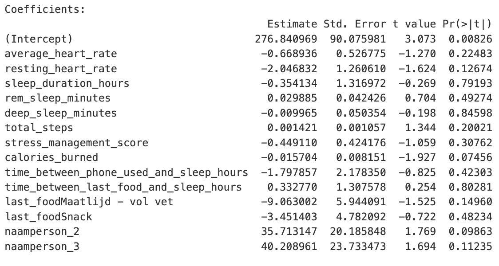

```

De variabelen met de laagste p-waarden in dit model (dus die het dichtst bij statistische significantie komen) zijn verbrande calorieen (p = 0.11).
De adjusted R^2 is hier 0.92, wat aangeeft dat dit model een groot deel van de variatie in gemiddelde hartslag tijdens slaap verklaart.
Helaas is geen enkele variabele in dit model statistisch significant (p < 0.05), wat betekent dat er in deze dataset geen sterk bewijs is voor een effect van deze variabelen op de gemiddelde hartslag tijdens slaap, als er rekening is gehouden met verschillen tussen personen.
De individuele voorspellers zelf dragen weinig bij aan het verklaren van de variatie binnen personen.

Het toevoegen van persoon als factor laat zien dat er grote verschillen zijn tussen personen, en dat de individuele variabelen niet sterk genoeg zijn om deze verschillen te verklaren.
Als het aantal meetdagen groter was geweest, zou er mogelijk meer variatie binnen personen zichtbaar zijn geweest, waardoor sommige van deze variabelen wel significant hadden kunnen worden.

We kunnen ook nog kijken naar de meervoudige regressie met de fitbit slaapscore vs factoren, om te zien of er misschien een verband is tussen slaapscore en deze factoren, maar gezien de onbetrouwbaarheid van de slaapscore is dat minder zinvol.

### Meervoudige Regressie Slaapscore vs. Factoren

```{r echo=FALSE, out.width="80%"}
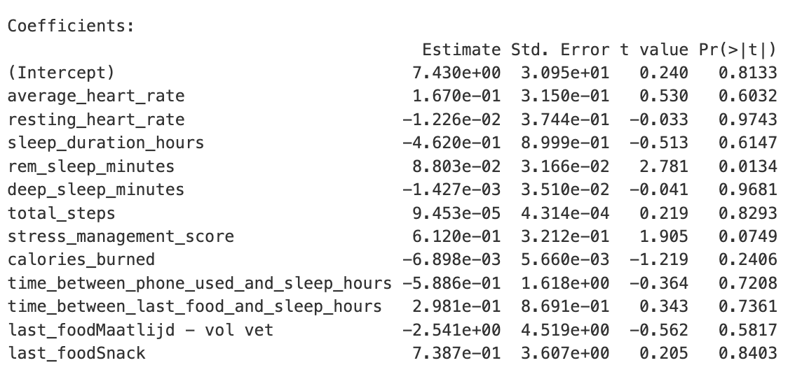
```

Hier is de hoeveelheid REM-slaap de enige variabele die statistisch significant is (p = 0.01), wat suggereert dat meer REM-slaap geassocieerd is met een hogere fitbit slaapscore in deze dataset. Dit is logisch, want de Fitbit slaat de slaapscore voor een groot deel op basis van de hoeveelheid REM-slaap.
Echter, gezien de onbetrouwbaarheid van de slaapscore en het feit dat deze sterk afhankelijk is van de slaapduur, moet dit resultaat met voorzichtigheid worden geïnterpreteerd.


### Meervoudige Regressie Slaapscore vs. Factoren (met persoon als factor)

```{r echo=FALSE, out.width="80%"}
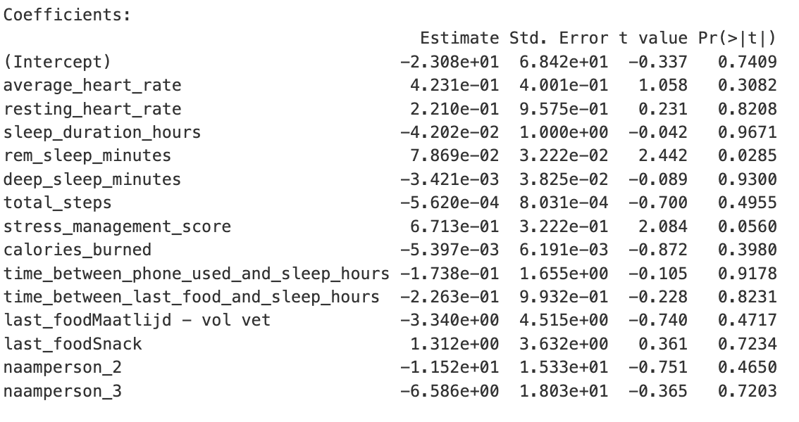
``` 

Ook hier is de hoeveelheid REM-slaap de enige variabele die statistisch significant is (p = 0.02).
De REM-slaap heeft dus veel invloed op de fitbit slaapscore en per persoon is er een sterk verband tussen deze twee variabelen. 
Nog steeds moet dit resultaat met voorzichtigheid worden geïnterpreteerd, gezien de onbetrouwbaarheid van de slaapscore en het feit dat deze sterk afhankelijk is van de slaapduur.

Deze paper focust zich verder op de gemiddelde hartslag tijdens slaap als indicator voor slaapkwaliteit, omdat deze minder beïnvloed wordt door de onnauwkeurigheid van de slaapduurmetingen van de Fitbit en een betrouwbaardere maat is voor slaapkwaliteit in deze dataset.

### R^2 van gemiddelde slaaphartslag per variabele

```{r echo=FALSE, out.width="80%"}
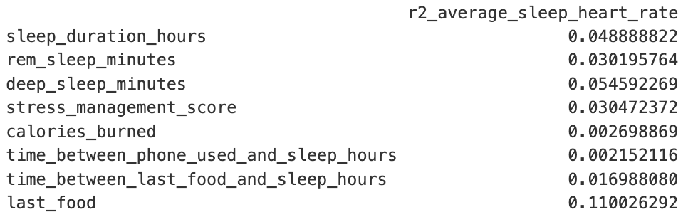
```

Voor de gemiddelde slaaphartslag zijn de R2‑waarden over het algemeen laag: last_food is het grootst met = 0.11 (11%), daarna deep_sleep_minutes = 5.5%, stress_management_score = 5.4% en sleep_duration_hours = 4.9%.
Sommige variabelen verklaren bijna niets (bv. calories_burned = 0.27%).

Pas als je de R^2 waarden bij elkaar neemt in een meervoudig model, krijg je een hoge R^2 van 0.82, wat aangeeft dat deze variabelen samen een sterk verband hebben met de gemiddelde hartslag tijdens slaap.


## Grafieken:

### Voorbeelden van niet-significante verbanden:

```{r echo=FALSE, out.width="80%"}
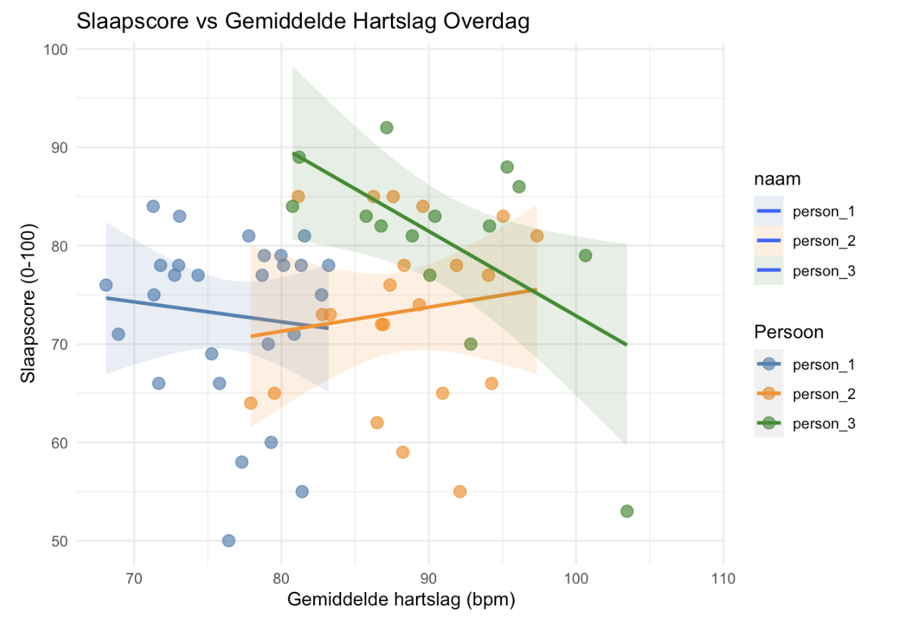
```

p-waarde zonder persoon als factor toegevoegd: ca. 0.77 (niet significant)

p-waarde met persoon als factor toegevoegd: 0.77 (niet significant)

**Observatie:** De punten en regressielijnen tonen zwakke en inconsistente verbanden tussen gemiddelde hartslag en de slaapscore.
Individuele grafieken laten verschillende richtingen en steilheden zien, en de gecombineerde plot toont veel overlap tussen personen.

Het verschil in resultaten tussen de grafieken van gemiddelde hartslag tijdens slaap en slaapscore is opvallend. De slaapscore lijkt geen betrouwbaar verband te hebben met de gemiddelde hartslag tijdens slaap, terwijl de gemiddelde hartslag tijdens slaap wel een duidelijker verband heeft met de gemiddelde rusthartslag en andere factoren.
Dit ondersteunt de keuze om de gemiddelde hartslag tijdens slaap als een betere indicator voor slaapkwaliteit te gebruiken dan de slaapscore, gezien de onbetrouwbaarheid van de slaapscore in deze dataset.
Vanwege de onbetrouwbaarheid van de slaapscore zal alleen de gemiddelde hartslag tijdens slaap als indicator voor slaapkwaliteit genomen worden en niet de slaapscore.


```{r echo=FALSE, out.width="80%"}
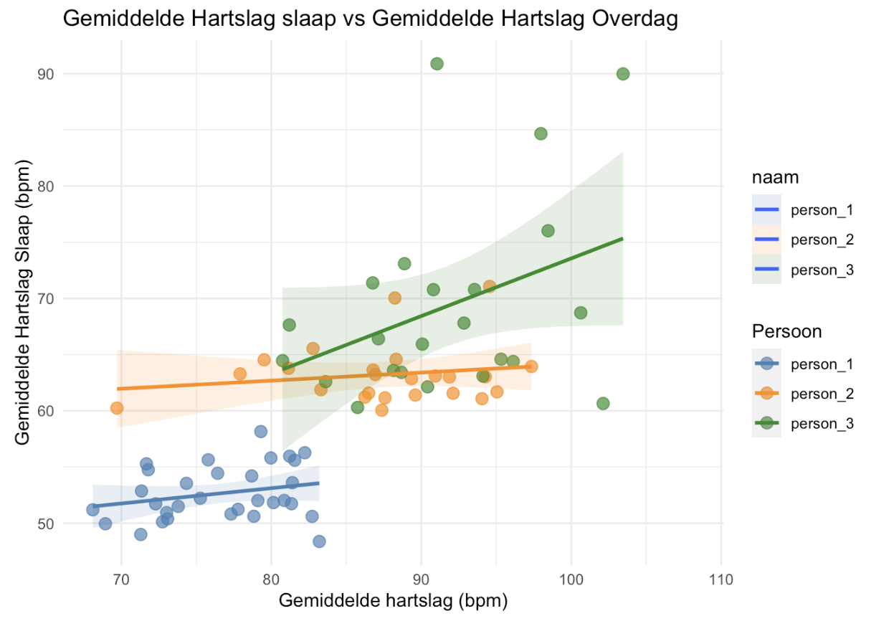
```

p-waarde zonder persoon als factor toegevoegd: ca. 0.80 (niet significant)

p-waarde met persoon als factor toegevoegd: ca. 0.18 (niet significant)

**Observatie:** Voor de relatie tussen gemiddelde hartslag en gemiddelde hartslag tijdens slaap is over het algemeen een positieve samenhang: personen met hogere hartslag overdag hebben vaak ook hogere gemiddelde hartslag tijdens slaap.
De individuele lijnen zijn relatief consistenter dan bij slaapscore, wat wijst op een sterkere relatie tussen deze twee hartslagmetingen.

```{r echo=FALSE, out.width="80%"}
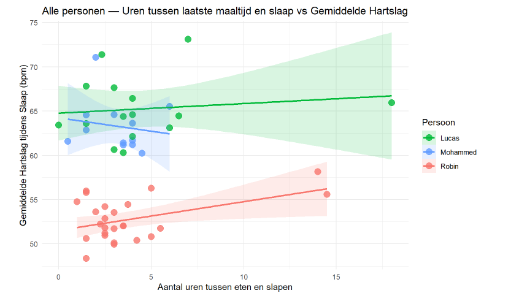
```

p-waarde zonder persoon als factor toegevoegd: ca. 0.84 (niet significant)

p-waarde met persoon als factor toegevoegd: ca. 0.80 (niet significant)

**Observatie:** Bij de eten-timing is er geen duidelijk, consistent verband zichtbaar.
Als we naar de plots kijken, vallen de grote verschillen tussen de drie proefpersonen direct op. persoon 1 heeft in de nacht standaard een veel lagere hartslag (rond de 53 bpm) dan persoon 2 en 3 (die rond de 64 bpm zitten).
Sommige personen laten een trend zien, maar de combinatie van lage aantallen en variatie tussen nachten maakt echte conclusies niet mogelijk.
Ook zijn de p-waarden van de laatste maaltijd (zowel zonder als met persoon als factor) hoog (ca. 0.84 en ca. 0.80), wat aangeeft dat er geen statistisch significant verband is.


```{r echo=FALSE, out.width="80%"}
knitr::include_graphics("Grafieken/gemiddelde_gemiddelde rusthartslag.png")
```
```{r echo=FALSE, out.width="30%", fig.cap="gemiddelde rusthartslag per persoon"}
knitr::include_graphics("Grafieken/gemiddelde rusthartslag_average.png")
```

p-waarde zonder persoon als factor toegevoegd: ca. 0.000029 (statistisch significant)

p-waarde met persoon als factor toegevoegd: ca. 0.37 (niet significant)

**Observatie:** Er is een duidelijke, grotendeels positieve samenhang tussen gemiddelde rusthartslag en gemiddelde hartslag tijdens slaap: nachten met een hogere gemiddelde rusthartslag gaan meestal gepaard met een hogere gemiddelde slaaphartslag.
Verder is de p-waarde als we de persoon niet meerekenen als factor zeer laag (0.000029), wat wijst op een sterk statistisch significant verband tussen deze twee variabelen in deze dataset.
Echter, als we de persoon wel als factor toevoegen, stijgt de p-waarde naar ca. 0.37, wat aangeeft dat er geen statistisch significant verband is wanneer er rekening wordt gehouden met verschillen tussen personen.
Dit geeft aan dat het effect van gemiddelde rusthartslag op gemiddelde hartslag tijdens slaap op groepsniveau sterk is, maar dat er grote individuele verschillen zijn die dit verband binnen personen moeilijk detecteerbaar maken.
Met een grotere steekproefgrootte en meer metingen per persoon zou er mogelijk meer variatie binnen personen zijn, waardoor dit verband wel significant zou kunnen worden.


```{r echo=FALSE, out.width="80%", fig.cap="REM-slaap vs. slaapscore"}
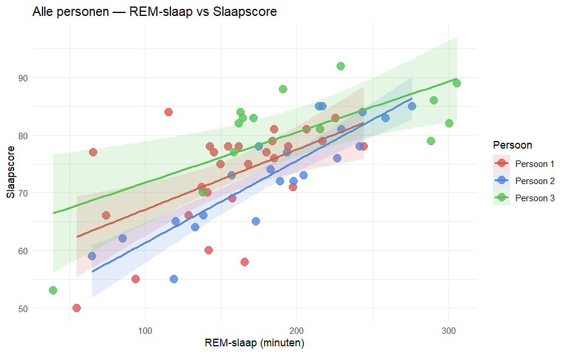
```

p-waarde zonder persoon als factor toegevoegd: ca. 0.01 (wel significant)  

p-waarde met persoon als factor toegevoegd: ca. 0.02 (wel significant)

**Observatie:** Een consistente bevinding is het positieve verband tussen REM-slaap en slaapscore, zichtbaar bij alle drie de proefpersonen. Dit kan een resultaat zijn van verschillende dingen: mogelijk meet de Fitbit de slaapscore op dezelfde manier als REM-slaap, waardoor meer REM automatisch een hogere score oplevert. Of het kan komen doordat meer REM-slaap samenhangt met een langere totale slaaptijd, wat de score eveneens verhoogt. Uit het onderzoek valt moeilijk een conclusie te trekken of de verbetering in slaapscore voortkomt uit een daadwerkelijke link tussen de twee, of dat er een andere verklaring achter zit.
Bij het vergelijken van REM-slaap tegenover slaapscore is bij alle drie de proefpersonen een stijgende lijn zichtbaar. Lucas heeft zowel de hoogste als laagste REM-waarden gemeten: de nacht met weinig REM-slaap correspondeert met een extreem lage slaapscore, terwijl nachten met veel REM-slaap hoge scores opleveren. Hetzelfde patroon geldt voor Mohammed. Robin vormt een uitzondering: ondanks veel REM-slaap scoort hij regelmatig lager, wat wijst op uitschieters. Bij de grafiek die REM-slaap tegenover gemiddelde hartslag vergelijkt is een zwakke negatieve trend zichtbaar bij alle drie de proefpersonen. In de grafiek van REM-slaap versus minimale hartslag is vrijwel geen duidelijk verband te zien.
De slaapscore is echter niet een volledig betrouwbare indicator voor slaapkwaliteit, dus het is moeilijk te zeggen hoe sterk het verband is tussen REM-slaap en daadwerkelijke slaapkwaliteit.


```{r echo=FALSE, out.width="80%"}
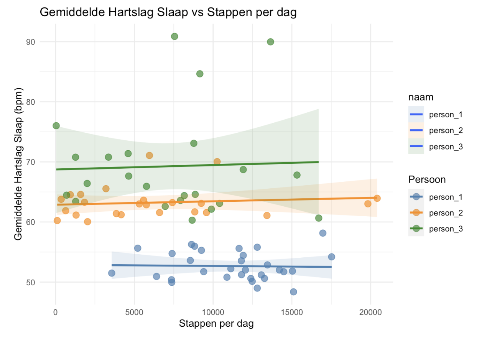
``` 
```{r echo=FALSE, out.width="80%"}
knitr::include_graphics("Grafieken/gemiddelde rusthartslag_vs_stappen.png")
```
```{r echo=FALSE, out.width="30%", fig.cap="Gemiddeld aantal stappen per dag per persoon"}
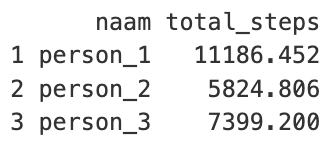
```

p-waarde zonder persoon als factor toegevoegd: ca. 0.02 (wel significant)

p-waarde met persoon als factor toegevoegd: ca. 0.20 (niet significant)

**Observatie:** De fysieke activiteit (stappenaantal) laat geen verband zien met slaapkwaliteit of hartslag per persoon; het verband verschilt per individu en de lijnen zijn haast niet te onderscheiden van een vlakke lijn.
Echter is er wel een correlatie op groepsniveau: meer stappen gaan samen met een lagere gemiddelde hartslag tijdens slaap.
Persoon 1 heeft bijvoorbeeld over het algemeen meer dan 10000 stappen per dag en heeft een aanzienlijk lagere gemiddelde hartslag tijdens slaap (rond de 50 bpm) dan persoon 2 en 3, die meestal rond de 6000 of 7000 stappen per dag zitten en een gemiddelde slaaphartslag van rond de 60 bpm hebben.
Ook de grafiek van gemiddelde rusthartslag versus stappen laat een klein verband per persoon zien, maar een groter verband op groepsniveau: meer stappen gaan samen met een lagere gemiddelde rusthartslag, wat weer samenhangt met een lagere gemiddelde hartslag tijdens slaap.

### Grafiekselectie

Niet alle gegenereerde grafieken zijn in de bespreking opgenomen. Grafieken waarbij de lijn volledig vlak verloopt en datapunten sterk verspreid zijn — zoals de vergelijking van REM-slaap met minimale hartslag en calorieën met minimale hartslag — zijn niet meegenomen in de conclusie. De opgenomen grafieken vertonen ten minste een zichtbare, bespreekbare trend.

### Beperkingen

De voornaamste beperking van dit onderzoek is de kleine steekproefgrootte van drie proefpersonen. Hierdoor kunnen de trends niet worden gegeneraliseerd naar een bredere bevolking en is het niet mogelijk verbanden statistisch vast te stellen. Daarnaast ontbreekt een controlegroep, en zijn stressniveau en tijdstip van sporten niet meegenomen als variabelen. Tot slot zijn de gebruikte fitness-trackers beperkt in nauwkeurigheid: slaapfasen worden geschat op basis van hartslag en beweging, niet gemeten via polysomnografie.
Gezien de kleine steekproef zijn de bevindingen uitsluitend verkennend van aard. Vervolgonderzoek met een grotere steekproef, gestandaardiseerde meetmethoden en controle voor confounders is nodig om de gesignaleerde verbanden te bevestigen of te weerleggen. Als er in een vervolgonderzoek opnieuw een verband tussen bijvoorbeeld REM-slaap en slaapkwaliteit wordt gevonden, is het aan te raden alle andere relevante factoren zo veel mogelijk te controleren.


# Conclusie

In dit onderzoek hebben we gekeken naar de relatie tussen slaapkwaliteit, hartslag en dagelijkse gewoonten bij drie proefpersonen die vier weken lang zijn gevolgd met een Fitbit. Het doel was om te onderzoeken of een betere slaap samenhangt met een lagere gemiddelde hartslag, vooral tijdens de slaap.
Uit de resultaten blijkt dat de gemiddelde hartslag tijdens slaap sterk samenhangt met de gemiddelde rusthartslag. Op groepsniveau zien we een duidelijk en statistisch significant verband: nachten met een hogere gemiddelde rusthartslag gaan meestal samen met een hogere gemiddelde slaaphartslag (p = ca. 0.00003). Dit ondersteunt het idee dat iemands algemene lichamelijke toestand een belangrijke rol speelt bij hoe goed het lichaam ’s nachts tot rust komt.
Daarnaast laten ook het aantal stappen per dag een significant verband zien met de gemiddelde hartslag tijdens slaap op groepsniveau (p = ca. 0.02). Personen die gemiddeld meer stappen zetten, hebben niet alleen een lagere gemiddelde hartslag tijdens de slaap, maar ook een lagere gemiddelde rusthartslag. Dit laat opnieuw zien dat een lagere gemiddelde rusthartslag samenhangt met een lagere gemiddelde hartslag tijdens de slaap, en dat fysieke activiteit hier waarschijnlijk indirect aan bijdraagt.

Wanneer we echter rekening houden met verschillen tussen personen door de naam als factor toe te voegen aan het model, verdwijnen deze significante verbanden voor zowel gemiddelde rusthartslag als stappen. Dit laat zien dat de gevonden effecten vooral worden veroorzaakt door vaste verschillen tussen mensen, en niet zozeer door veranderingen binnen één persoon. Met andere woorden: sommige mensen hebben van zichzelf een lagere hartslag en zijn actiever, en dit bepaalt een groot deel van het verband in de groep. Binnen personen is het effect in deze dataset te klein of te wisselend om statistisch significant aan te tonen.
Andere factoren, zoals verbrande calorieën, stressmanagement, slaapduur en het tijdstip of soort van de laatste maaltijd, laten geen duidelijke significante verbanden zien met de gemiddelde hartslag tijdens slaap, zeker niet wanneer er per persoon wordt gecorrigeerd.

De Fitbit-slaapscore bleek in dit onderzoek geen betrouwbare maat voor slaapkwaliteit. De slaapscore wordt sterk beïnvloed door slaapduur en laat veel schommelingen zien, waardoor verbanden met andere variabelen zwak en niet consistent zijn. Daarom is in deze paper gekozen om de gemiddelde hartslag tijdens slaap te gebruiken als belangrijkste maat voor slaapkwaliteit, omdat deze minder gevoelig is voor meetfouten in slaapduur en beter laat zien hoe goed het lichaam tot rust komt.
Wel is er één duidelijk en constant significant verband gevonden met de Fitbit-slaapscore: de duur van de REM-slaap. Zowel met als zonder correctie voor persoon is REM-slaap significant gekoppeld aan een hogere slaapscore (p = ca. 0.01–0.02). Dit is logisch, omdat de Fitbit-slaapscore voor een groot deel wordt bepaald door de hoeveelheid REM-slaap. Dit betekent echter niet automatisch dat de slaapscore een goede maat is voor echte slaapkwaliteit, maar vooral dat de score technisch sterk samenhangt met REM-slaap.


Kortom, de belangrijkste conclusies van dit onderzoek zijn:

De gemiddelde rusthartslag overdag en de gemiddelde hartslag tijdens de slaap hangen op groepsniveau sterk samen. Ook het aantal stappen per dag hangt samen met de gemiddelde hartslag tijdens de slaap, waarbij meer stappen en een lagere gemiddelde rusthartslag samengaan met een lagere hartslag tijdens de slaap.

Dit wijst erop dat mensen met een betere algemene lichamelijke conditie (lagere gemiddelde rusthartslag, meer fysieke activiteit) ook een lagere hartslag tijdens de slaap hebben, wat duidt op een betere slaapkwaliteit.
Wanneer er wordt gecorrigeerd voor verschillen tussen personen echter, verdwijnen deze verbanden. Dit laat zien dat de effecten vooral worden verklaard door vaste verschillen tussen individuen, en minder door veranderingen binnen personen.
Door het kleine aantal metingen per persoon kunnen er geen betrouwbare effecten binnen personen worden vastgesteld. Verder onderzoek met meer data per persoon is nodig om dit beter te onderzoeken.

De Fitbit-slaapscore blijkt geen stabiele maat voor slaapkwaliteit in dit onderzoek, omdat deze sterk wordt beïnvloed door slaapduur en de metingen hiervan onnauwkeurig zijn. Daarom is de gemiddelde hartslag tijdens slaap een betere indicator voor slaapkwaliteit in deze dataset.
Alleen REM-slaap hangt duidelijk samen met de slaapscore, wat vooral de rekenwijze van de Fitbit laat zien.

Op basis van de resultaten kan de nulhypothese voor het verband tussen gemiddelde rusthartslag en gemiddelde hartslag tijdens de slaap worden verworpen op groepsniveau. Verder onderzoek is nodig om te bepalen of er ook binnen personen een verband bestaat, en om de rol van andere factoren beter te begrijpen. 