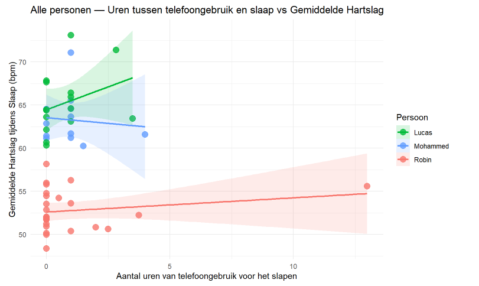
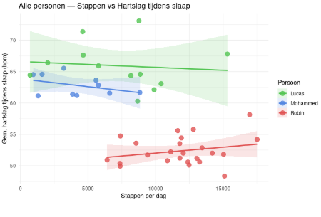

# Introductie

Slaap is een van de belangrijkste processen voor het herstel van het lichaam en de hersenen. Tijdens de slaap vertraagt de hartslag, wat vaak een teken is dat het lichaam goed tot rust komt. Een lagere hartslag tijdens de slaap wordt daarom vaak gezien als een teken van goede slaapkwaliteit (Cleveland Clinic, 2024).

Uit onderzoek blijkt dat verschillende factoren invloed hebben op de hartslag. Zo spelen stress, lichamelijke beweging en dagelijkse gewoonten een grote rol bij hoe hoog of laag de hartslag is, zowel overdag als tijdens de slaap (Valentini & Parati, 2009). Wanneer het lichaam voldoende kan herstellen, daalt de hartslag en komt het lichaam in een diepere rusttoestand.

In dit onderzoek wordt gekeken of een betere slaapkwaliteit samenhangt met een lagere gemiddelde hartslag, zowel overdag als tijdens de slaap. Drie proefpersonen meten gedurende vier weken hun hartslag met behulp van een Fitbit-smartwatch. Deze smartwatch houdt continu de hartslag bij en verzamelt ook gegevens over de slaap.

Naast de hartslagmetingen vullen de proefpersonen elke dag een korte vragenlijst in. Hierin noteren zij factoren die mogelijk invloed hebben op hun slaap en hartslag, zoals lichamelijke beweging, alcoholgebruik, laat eten en schermgebruik vlak voor het slapengaan. Het gebruik van een telefoon voor het slapen kan de slaap verstoren en zorgen voor een minder diepe slaap, wat invloed kan hebben op de hartslag (Cleveland Clinic, 2022).

De verwachting is dat proefpersonen met een lagere gemiddelde hartslag beter slapen. Ook wordt verwacht dat voldoende beweging overdag en het beperken van storende gewoonten, zoals veel schermgebruik voor het slapen, bijdragen aan een lagere hartslag en een betere slaapkwaliteit.

Dit onderzoek is belangrijk omdat het laat zien hoe dagelijkse gewoonten invloed hebben op slaap en hartslag. Door deze verbanden beter te begrijpen, kunnen mensen bewuster keuzes maken die zorgen voor betere rust en herstel.

---

# Resultaten

## 1. Eten en schermgebruik vs. gemiddelde hartslag tijdens de slaap

```{r echo=FALSE, out.width="80%", fig.cap="Uren tussen eten en slaap vs. Gemiddelde Hartslag"}
knitr::include_graphics("Grafieken/eten_grafiek.png")
```

```{r echo=FALSE, out.width="80%", fig.cap="Uren tussen telefoongebruik en slaap vs. Gemiddelde Hartslag"}

```

## 2. REM-slaap, verbrande calorieën en voetstappen vs. slaapscore en hartslag

```{r echo=FALSE, out.width="80%", fig.cap="Verbrande calorieën vs. hartslag"}
knitr::include_graphics("Grafieken/grafiek_calorieen.png")
```

Bij de grafiek die verbrande calorieën vergelijkt met slaapscore is bij alle drie een licht negatieve trend zichtbaar. Dit is het sterkst bij Lucas, waar lage calorieverbranding (~150 kcal) samengaat met slaapscores van soms boven de negentig. Bij de vergelijking met gemiddelde hartslag tijdens slaap zijn de lijnen van Robin en Mohammed vrijwel vlak, terwijl Lucas een stijgende trend vertoont.

```{r echo=FALSE, out.width="80%", fig.cap="REM-slaap vs. slaapscore"}
knitr::include_graphics("Grafieken/grafiek_REM-slaap.png")
```

Bij het vergelijken van REM-slaap tegenover slaapscore is bij alle drie de proefpersonen een stijgende lijn zichtbaar. Lucas heeft zowel de hoogste als laagste REM-waarden gemeten: de nacht met weinig REM-slaap correspondeert met een extreem lage slaapscore, terwijl nachten met veel REM-slaap hoge scores opleveren. Hetzelfde patroon geldt voor Mohammed. Robin vormt een uitzondering: ondanks veel REM-slaap scoort hij regelmatig lager, wat wijst op uitschieters. Bij de grafiek die REM-slaap tegenover gemiddelde hartslag vergelijkt is een zwakke negatieve trend zichtbaar bij alle drie de proefpersonen. In de grafiek van REM-slaap versus minimale hartslag is vrijwel geen duidelijk verband te zien.

```{r echo=FALSE, out.width="80%", fig.cap="Stappen vs. hartslag"}

```

Bij de grafiek die hartslag versus stappen vergelijkt is bij Lucas en Mohammed een lichte daling in gemiddelde hartslag zichtbaar naarmate het stappenaantal stijgt. Bij Robin lijkt de hartslag juist toe te nemen. Bij de grafiek met minimale hartslag is een soortgelijk patroon te zien, met het verschil dat ook Mohammeds minimale hartslag stijgt bij meer stappen. Bij de grafiek die stappen tegenover slaapscore uitzet is bij Robin en Mohammed vrijwel geen verband zichtbaar, terwijl Lucas een licht dalende trend toont.

---

# Conclusie en Discussie

## 1. Eten en schermgebruik vs. hartslag tijdens slaap

**Wat zien we in de grafieken?**

Als we naar de plots kijken, vallen de grote verschillen tussen de drie proefpersonen direct op. Robin heeft in de nacht standaard een veel lagere hartslag (rond de 53 bpm) dan Lucas en Mohammed (die rond de 64 bpm zitten).

- **Bij de eten-timing** is alleen bij Mohammed de hartslag lager als er meer uren tussen de maaltijd en het slapen zitten. Bij Robin en Lucas loopt de lijn juist een klein beetje omhoog.
- **Bij de scherm-timing** valt op dat Mohammed en Lucas hun telefoon bijna altijd direct voor het slapen wegleggen. Robin heeft een paar grote uitschieters (tot wel 15 uur voor het slapen). Deze losse uitschieters trekken de trendlijn bij Robin en Lucas enigszins vertekend omhoog.

**Niet statistisch significant**

Hoewel de lijnen in de grafieken een richting op bewegen, laat de statistiek zien dat dit effect **niet statistisch significant** is. De p-waarden zijn groter dan 0,05. Dit betekent dat het aantal uren tussen het eten of telefoongebruik en het slapengaan in dit onderzoek **niet officieel bewijzen** dat de hartslag hierdoor verandert. De verbanden die we in de grafiek zien, kunnen dus ook door toeval komen.

**Alleen effect bij het type eten**

Het enige moment waarop er wel een duidelijk verschil zichtbaar is, is bij het **type eten** uit de boxplot. Het eten van een zware, vette maaltijd zorgt er duidelijk voor dat het lichaam 's nachts harder moet werken. Hierdoor gaat de gemiddelde hartslag tijdens de slaap omhoog vergeleken met een lichte snack of een magere maaltijd.

## 2. REM-slaap, stappen en verbrande calorieën vs. hartslag tijdens slaap

### Grafiekselectie

Niet alle gegenereerde grafieken zijn in de bespreking opgenomen. Grafieken waarbij de lijn volledig vlak verloopt en datapunten sterk verspreid zijn — zoals de vergelijking van REM-slaap met minimale hartslag en calorieën met minimale hartslag — zijn niet meegenomen in de conclusie. De opgenomen grafieken vertonen ten minste een zichtbare, bespreekbare trend.

### Interpretatie van de bevindingen

De meest consistente bevinding is het positieve verband tussen REM-slaap en slaapscore, zichtbaar bij alle drie de proefpersonen. Dit kan een resultaat zijn van verschillende dingen: mogelijk meet de Fitbit de slaapscore op dezelfde manier als REM-slaap, waardoor meer REM automatisch een hogere score oplevert. Of het kan komen doordat meer REM-slaap samenhangt met een langere totale slaaptijd, wat de score eveneens verhoogt. Uit het onderzoek valt moeilijk een conclusie te trekken of de verbetering in slaapscore voortkomt uit een daadwerkelijke link tussen de twee, of dat er een andere verklaring achter zit.

Het stappenaantal toont geen duidelijk verband met slaapkwaliteit of hartslag. De richting van de trend verschilt per proefpersoon, wat erop wijst dat het aantal stappen alleen een te grove maat is voor fysieke belasting. Intensiteit, tijdstip van de activiteit en individueel herstelvermogen zijn variabelen die hierbij een rol spelen maar niet zijn gemeten.

De licht negatieve relatie tussen calorieverbranding en slaapscore sluit aan bij bevindingen dat intensieve inspanning de slaapkwaliteit op de korte termijn kan verlagen, met name wanneer dit laat op de dag plaatsvindt. Het verband is echter zwak en niet consistent genoeg voor sterke conclusies.

### Beperkingen

De voornaamste beperking van dit onderzoek is de kleine steekproefgrootte van drie proefpersonen. Hierdoor kunnen de trends niet worden gegeneraliseerd naar een bredere bevolking en is het niet mogelijk verbanden statistisch vast te stellen. Daarnaast ontbreekt een controlegroep, en zijn stressniveau en tijdstip van sporten niet meegenomen als variabelen. Tot slot zijn de gebruikte fitness-trackers beperkt in nauwkeurigheid: slaapfasen worden geschat op basis van hartslag en beweging, niet gemeten via polysomnografie.

---

# Conclusie

Op basis van de verzamelde data kunnen de volgende voorzichtige conclusies worden getrokken:

1. **REM-slaap en slaapkwaliteit** vertonen de sterkste en meest consistente samenhang: meer REM-slaap gaat bij alle drie de proefpersonen gepaard met een hogere slaapscore, maar dit kan ook door andere factoren worden verklaard.
2. **Fysieke activiteit (stappenaantal)** laat geen eenduidig verband zien met slaapkwaliteit of hartslag; het verband verschilt per individu.
3. **Calorieverbranding** toont een zwak negatief verband met slaapscore, maar dit is onvoldoende consistent voor definitieve uitspraken.

Gezien de kleine steekproef zijn de bevindingen uitsluitend verkennend van aard. Vervolgonderzoek met een grotere steekproef, gestandaardiseerde meetmethoden en controle voor confounders is nodig om de gesignaleerde verbanden te bevestigen of te weerleggen. Als er in een vervolgonderzoek opnieuw een verband tussen bijvoorbeeld REM-slaap en slaapkwaliteit wordt gevonden, is het aan te raden alle andere relevante factoren zo veel mogelijk te controleren.
